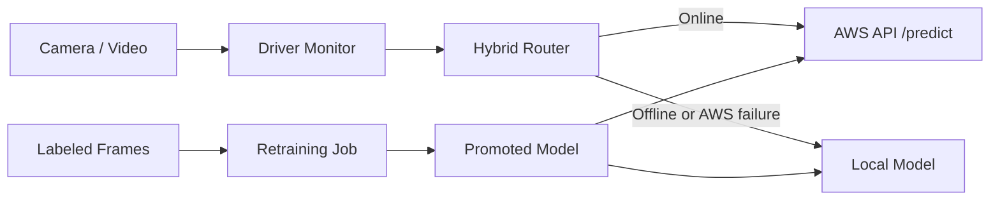

# Hybrid Drowsy Driver Platform

Final-year project for real-time driver drowsiness detection with:

- Local camera/video monitoring.
- Hybrid inference routing.
- AWS-ready remote inference API.
- Offline fallback model.
- Docker Compose deployment.
- Simple auto-retraining pipeline.

## Architecture



## Main Files

- `app/main.py`: FastAPI inference API.
- `scripts/run_monitor.py`: real-time camera/video monitor.
- `scripts/check_camera.py`: checks available camera indexes.
- `scripts/label_frames.py`: creates `alert` / `drowsy` training data from video or camera.
- `scripts/retrain_once.py`: trains a candidate model and promotes it if metrics pass.
- `src/drowsy_platform/hybrid.py`: online/offline routing logic.
- `src/drowsy_platform/monitor.py`: EAR/MAR + CNN decision logic.
- `src/drowsy_platform/training.py`: training and promotion pipeline.
- `docker-compose.yml`: API service and retraining service.

## Quick Start With Docker

Create `.env`:

```bash
cp .env.example .env
```

Run the API:

```bash
docker compose up --build
```

Open:

```text
http://localhost:8000/healthz
http://localhost:8000/docs
```

Run retraining with Docker:

```bash
docker compose run --rm retrain
```

## Run Camera Or Video

Docker Compose runs the API. The camera monitor should usually run outside Docker because webcams are easier to access from the host OS.

Linux/camera:

```bash
cd ~/ARK
python scripts/check_camera.py
python scripts/run_monitor.py --source 0
```

Linux camera with Docker Compose, if `/dev/video0` and GUI forwarding are available:

```bash
xhost +local:docker
CAMERA_DEVICE=/dev/video0 docker compose --profile camera run --rm monitor-camera
```

WSL/video:

```bash
cd /mnt/f/ARK
source .venv/bin/activate
python scripts/run_monitor.py --source /mnt/f/ARK/vvv.mp4
```

Windows/camera:

```powershell
cd F:\ARK
.\.venv-win\Scripts\Activate.ps1
python scripts\check_camera.py
python scripts\run_monitor.py --source 0
```

## Hybrid Mode

Local-only mode:

```env
SERVICE_MODE=local_only
LOCAL_MODEL_BACKEND=keras
LOCAL_MODEL_PATH=./drowsy_model.h5
```

Hybrid mode:

```env
SERVICE_MODE=hybrid
REMOTE_ENDPOINT_URL=http://EC2_PUBLIC_IP:8000/predict
LOCAL_MODEL_BACKEND=keras
LOCAL_MODEL_PATH=./drowsy_model.h5
```

When the remote endpoint is reachable, predictions use AWS. If the network or AWS API fails, the app falls back to the local model.

## Retraining Flow

Create training data:

```bash
python scripts/label_frames.py --source /path/to/video.mp4 --every-n 10
```

Expected dataset shape:

```text
data/train_data/
  alert/
  drowsy/
```

Run retraining:

```bash
docker compose run --rm retrain
```

If the model passes the promotion threshold, it is written to:

```text
artifacts/production/model.keras
artifacts/production/manifest.json
```

Use the promoted model:

```env
LOCAL_MODEL_PATH=./artifacts/production/model.keras
```

## Documentation

- `docs/GIT_AND_LAPTOP_SETUP.md`: move project to another laptop and run with Docker.
- `docs/AWS_HYBRID_RETRAINING_GUIDE.md`: deploy API to AWS and run hybrid/retraining flow.
- `docs/LINUX_REAL_CAMERA_SETUP.md`: run a real webcam on Linux.
- `docs/FINAL_PROJECT_DOCUMENTATION.md`: full final project documentation.
- `docs/FINAL_DEMO_CHECKLIST.md`: final presentation checklist.
